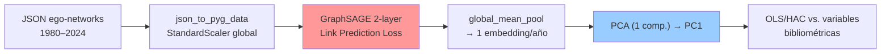

# Análisis Metodológico Crítico: ¿Está Justificado GraphSAGE?

## 1. Mapa del Pipeline Actual



| Componente | Archivo | Detalle clave |
|---|---|---|
| Modelo | [model.py](file:///home/jose/Programming/SS/Sage/src/gnn/model.py) | 2 capas SAGEConv (8→32→8), dropout 0.1 |
| Entrenamiento | [train.py](file:///home/jose/Programming/SS/Sage/src/gnn/train.py) | Link prediction con negative sampling (BCEWithLogitsLoss) |
| Pipeline temporal | [pipeline.py](file:///home/jose/Programming/SS/Sage/src/gnn/pipeline.py) | Warm-start secuencial, `global_mean_pool` por año |
| Análisis PCA/Corr | [analysis.py (gnn)](file:///home/jose/Programming/SS/Sage/src/gnn/analysis.py) | PCA 1D/2D, Pearson, alineación de signo |
| Regresión OLS/HAC | [analysis.py (stats)](file:///home/jose/Programming/SS/Sage/src/stats/analysis.py) | OLS con HAC Newey-West (3 lags), diagnóstico de residuos |
| Discretización | [analysis.py (stats)](file:///home/jose/Programming/SS/Sage/src/stats/analysis.py) | Cuantiles globales, shares ponderadas/no ponderadas |

---

## 2. Observaciones Críticas sobre el Pipeline

### 2.1 GraphSAGE recibe las variables bibliométricas como features de nodo

> [!CAUTION]
> En [data_loader.py](file:///home/jose/Programming/SS/Sage/src/gnn/data_loader.py#L46-L56), las 8 features de entrada a GraphSAGE **son exactamente las mismas variables bibliométricas** que después se usan como regresores en OLS. Esto es un problema fundamental:

Las features de nodo incluyen: `WoS Categories`, `Document Types`, `Documents,`, `Ave. citations`, `Ave. authorships`, `Ave. references`, `Percent of documents`, `Percent of documents Int. Coll.`

Esto significa que **GraphSAGE no aprende una representación "puramente topológica"** — está aprendiendo una representación que combina topología (vía message-passing sobre la estructura de aristas) **con** señales bibliométricas (vía las features de nodo). La hipótesis de "separar niveles" (estructura topológica vs. interpretación bibliométrica) **no se cumple en la implementación actual**, porque la GNN recibe ambas señales simultáneamente.

### 2.2 La cadena de compresión es extrema

El pipeline comprime información de la siguiente forma:

```
~N nodos × 8 features × ~44 años
    → 8-dim embedding por nodo
        → 1 vector de 8-dim por año (mean pooling)
            → 1 escalar por año (PCA PC1)
                → 1 regresión OLS con ~44 observaciones
```

Al final, la variable dependiente tiene **~44 observaciones** (una por año). Esto plantea varias preguntas:

1. **¿Se necesita una GNN para producir ~44 escalares?** Modelos estadísticos simples podrían producir directamente esas ~44 observaciones sin pasar por una cadena de 5 transformaciones.
2. **El R² de 0.84 con 44 observaciones es muy poco restrictivo**: con 3-4 predictores y 44 observaciones, es fácil obtener R² altos por sobreajuste, especialmente sin validación out-of-sample.

### 2.3 El objetivo de entrenamiento (link prediction) no está alineado con el objetivo de análisis

GraphSAGE se entrena para **predecir aristas** (reconstruir la topología). Sin embargo, el análisis posterior busca **explicar evolución temporal** vía regresión contra variables bibliométricas. No hay garantía teórica ni empírica de que una representación optimizada para link prediction capture precisamente las características topológicas relevantes para la evolución temporal del sistema.

### 2.4 La inestabilidad entre semillas es un problema, no un feature

La similitud coseno cercana a 0 entre componentes de diferentes semillas indica que **el espacio latente rota arbitrariamente**. Argumentar que "la relación se mantiene estable" a pesar de esto requiere evidencia mucho más fuerte que la presentada. Una pregunta legítima del revisor: *si el espacio rota completamente, ¿qué significa realmente PC1?*

---

## 3. Baselines Propuestos

Para evaluar si GraphSAGE añade valor, hay que construir baselines que capturen diferentes "niveles" de complejidad, comparados todos contra la misma variable dependiente.

### Baseline 0: Promedios anuales directos (sin modelo)

Ya implementado parcialmente en [obtener_promedios_anuales](file:///home/jose/Programming/SS/Sage/src/gnn/analysis.py#L56-L80). Simplemente tomar el promedio anual de cada variable bibliométrica → esto ya **es** la serie temporal que se intenta explicar. El hecho de que ya exista en tu código y produzca correlaciones fuertes con PC1 debería encender una alarma.

**Pregunta clave**: ¿Qué información adicional aporta `PCA(GraphSAGE(X))` respecto a `mean(X)` directamente?

### Baseline 1: PCA directamente sobre atributos agregados

```
mean(X_bibliométricas) por año → PCA → PC1_raw
```

Comparar `PC1_raw` contra `PC1_graphsage`. Si la correlación es alta (~0.9+), GraphSAGE no está añadiendo información topológica sustancial.

### Baseline 2: Métricas topológicas clásicas

Calcular para cada snapshot anual las métricas estándar de la red:

- Densidad del grafo
- Grado medio / distribución de grado
- Coeficiente de clustering (global y medio)
- Centralidad de intermediación promedio
- Número de componentes conexas
- Diámetro / distancia media
- Asortatividad por grado

Después: `PCA(métricas_topológicas) → PC1_topo`. Esto **sí** captura estructura topológica pura, sin features de nodo, y sin la maquinaria de una GNN.

### Baseline 3: Modelo de factores latentes

Aplicar **Factor Analysis** o **PCA rotado** directamente sobre la matriz `[años × variables_bibliométricas]`. Si un solo factor latente captura >60% de varianza (que es lo que reportas para GraphSAGE), tu GNN no mejora la compresión.

### Baseline 4: Modelo temporal simple

- ARIMA sobre las series bibliométricas individuales
- VAR (Vector Autoregression) multivariado para capturar dinámicas conjuntas
- Simplemente regresión contra el tiempo ([year](file:///home/jose/Programming/SS/Sage/src/stats/data_loader.py#140-226) como predictor)

Si `PC1 ~ year` tiene R² alto, gran parte de la señal es simplemente una tendencia temporal monotónica que no necesita GraphSAGE.

### Baseline 5: GraphSAGE con features constantes (ablación topológica)

Ejecutar GraphSAGE con `x = torch.ones(N, 1)` (features unitarias) para **aislar la contribución topológica pura**. Si `PC1_topology_only` correlaciona bien con las variables bibliométricas, la topología sí aporta. Si no, las features de nodo son las que llevan la señal.

### Baseline 6: MLP sin estructura de grafo

Un MLP que reciba las mismas features de nodo, sin message-passing, con la misma función de loss. Diferencia con GraphSAGE: no usa la topología. Si MLP ≈ GraphSAGE, la topología no aporta.

---

## 4. Diseño de Ablaciones

Cada ablación aísla una componente del pipeline.

| Ablación | Qué se elimina/sustituye | Qué se mide |
|---|---|---|
| **A1**: Sin GNN | Reemplazar GraphSAGE por `mean(features)` directo | ¿PC1 cambia? |
| **A2**: Sin features | GraphSAGE con `x = ones(N,1)` | ¿Se mantiene la señal? |
| **A3**: Sin topología | MLP sobre features (sin `edge_index`) | ¿Qué aportan las aristas? |
| **A4**: Sin PCA | Usar `mean_pooled_embedding[0]` directamente como variable Y | ¿PCA añade o distorsiona? |
| **A5**: Sin warm-start | `PRESERVAR_HISTORIA = False` | ¿La transferencia temporal importa? |
| **A6**: Sin pooling | Tomar mediana, max-pool, o attention-pool | Sensibilidad al tipo de agregación |
| **A7**: Features parciales | Quitar subgrupos de features (e.g., solo `scores`, solo `weights`) | ¿Qué grupo de variables domina? |

### Protocolo experimental recomendado

Para cada configuración:
1. Ejecutar 30 semillas
2. Computar PC1 por semilla
3. Registrar: EV1, R² ajustado de OLS/HAC, p-values, estabilidad de coeficientes entre semillas
4. Comparar todas las configuraciones con **los mismos criterios**

---

## 5. Métricas de Comparación

### Métricas primarias (decisivas)

| Métrica | Para qué sirve | Cómo usarla |
|---|---|---|
| **R² ajustado** | Penaliza complejidad del modelo | Comparar pipeline completo vs. baselines con mismo nº de observaciones |
| **AIC / BIC** | Selección de modelo con penalización por parsimonia | Las regresiones OLS finales son directamente comparables |
| **Error fuera de muestra (CV)** | Generalización real | Leave-one-out CV o blocked time-series CV (dado que son datos temporales) |
| **Estabilidad entre semillas** | ¿El resultado es robusto? | σ(R²) sobre 30 semillas; σ(β) de cada coeficiente |

### Métricas secundarias (informativas)

| Métrica | Para qué sirve |
|---|---|
| **Correlación PC1_graphsage vs. PC1_baseline** | Si ρ > 0.9, GraphSAGE no aporta información nueva |
| **Durbin-Watson / ACF residuos** | Ya lo implementas; aplicar uniformemente a todos los baselines |
| **Breusch-Pagan** | Idem — homocedasticidad |
| **Mallows' Cp** | Alternativa a AIC para comparación de subsets |
| **Cross-validated RMSE** | Más interpretable que R² para muestras pequeñas |

---

## 6. Evidencia Necesaria para Cada Conclusión

### Conclusión A: "GraphSAGE no mejora sustancialmente"

Se sostiene si **cualquiera** de estas condiciones se cumple:

1. `R²_adj(baseline_0) ≈ R²_adj(pipeline_completo)` — los promedios directos explican igual
2. [corr(PC1_graphsage, PC1_raw_pca) > 0.90](file:///home/jose/Programming/SS/Sage/src/stats/visualization.py#68-77) — la GNN no transforma la señal  
3. `AIC(baseline) < AIC(pipeline)` — el modelo simple es preferido formalmente
4. `R²_adj(A2_sin_features) << R²_adj(pipeline)` — las features, no la topología, llevan la información
5. La varianza entre semillas del pipeline GNN es mayor que la diferencia entre pipeline y baseline

### Conclusión B: "La complejidad de la GNN no está justificada"

Se sostiene si:

1. Baseline topológico (métricas clásicas) captura información equivalente sin GNN
2. La ablación de topología (MLP) produce resultados comparables
3. El warm-start no mejora significativamente respecto a entrenamiento independiente
4. El pipeline completo no supera la línea base en validación out-of-sample (no solo in-sample R²)

### Conclusión C: "GraphSAGE SÍ aporta valor real"

Se sostiene **solo si**:

1. `R²_adj(pipeline) > R²_adj(todos_los_baselines)` por un margen significativo (>0.10)
2. El pipeline supera baselines en validación out-of-sample
3. La ablación A2 (sin features) mantiene señal → topología real aporta
4. La ablación A3 (MLP) pierde señal → message-passing aporta
5. La estabilidad entre semillas del pipeline es aceptable (σ(R²) < 0.10)

---

## 7. Trampas Metodológicas a Evitar

> [!WARNING]
> Estos son los sesgos más frecuentes y más dañinos en este tipo de análisis comparativo.

### 7.1 Sesgo de confirmación por evaluación in-sample

Con ~44 observaciones y 3-4 predictores, **cualquier** modelo razonable puede alcanzar R² de 0.7-0.9 por puro sobreajuste. **Obligatorio**: usar validación out-of-sample. Dado que son datos temporales, usar **time-series cross-validation** (e.g., expanding window o blocked CV), nunca shuffled k-fold.

### 7.2 Data leakage en el pipeline

Las features de nodo son las mismas variables que se usan como regresores. `PCA(GNN(X_biblio))` correlaciona con `X_biblio` → esto no es un descubrimiento, es una tautología parcial. No puedes afirmar que "la topología explica las variables bibliométricas" si le diste esas variables a la GNN como entrada.

### 7.3 Comparaciones asimétricas

Si al pipeline GraphSAGE le permites 30 semillas y reportas la mejor, pero al baseline le das una sola oportunidad, la comparación está sesgada. **Todas las variantes deben evaluarse bajo el mismo protocolo**.

### 7.4 Interpretar R² alto como evidencia de mecanismo

Un R² de 0.84 dice que la regresión ajusta bien **esos datos**, no que GraphSAGE sea el mecanismo correcto. Si un promedio ponderado consigue R² de 0.80, la ganancia marginal de GraphSAGE (0.04) no justifica su complejidad.

### 7.5 La "explicación de la varianza" en PCA no es lo mismo que "explicar el fenómeno"

EV1 ≈ 0.60-0.67 para GraphSAGE. Si PCA directamente sobre `mean(X)` genera EV1 ≈ 0.70, el PCA sobre el embedding no mejoró nada — y solo añadió ruido de muestreo por la estocasticidad de la GNN.

### 7.6 Ignorar la autocorrelación temporal en las comparaciones

Ya usas HAC en las regresiones (bien), pero las correlaciones de Pearson reportadas en [analysis.py](file:///home/jose/Programming/SS/Sage/src/gnn/analysis.py#L82-L110) **no corrigen por autocorrelación**. Con series temporales suaves, una correlación de 0.90 puede no ser significativa realmente. Considerar usar correlaciones con corrección por grados de libertad efectivos (método de Chelton, 1983) o directamente la significancia de los coeficientes HAC.

---

## 8. Estrategia Narrativa para el Artículo

### Estructura recomendada (no sesgada)

En lugar de "*demostramos que GraphSAGE funciona*", la narrativa debería ser:

1. **Planteamiento honesto**: "Proponemos un pipeline GNN+PCA+OLS para conectar topología con bibliometría. La pregunta central no es si el pipeline ajusta bien, sino si la componente GNN aporta información que métodos más simples no puedan capturar."

2. **Comparación estructurada**: Presentar tabla con todas las variantes (baselines + ablaciones), evaluadas con las mismas métricas. Dejar que los datos hablen.

3. **Tres escenarios narrativos posibles**:

   - **Escenario favorable**: "GraphSAGE captura señales topológicas que los baselines no detectan, como lo demuestra la ablación A2 y la superioridad en CV out-of-sample."
   - **Escenario neutro**: "El pipeline GNN produce resultados comparables a métricas topológicas clásicas, pero ofrece una representación más compacta y generalizable."
   - **Escenario desfavorable (pero publicable)**: "Los baselines estadísticos consiguen resultados equivalentes. Esto es un hallazgo en sí mismo: en redes egocéntricas de este tamaño, la complejidad de una GNN no está justificada, y modelos parsimoniosos son preferibles."

4. **Contribución reencuadrada**: Si GraphSAGE no supera a los baselines, tu contribución puede ser precisamente **la demostración empírica de que no se necesita** — eso también es publicable y útil para la comunidad.

---

## 9. Propuesta de Experimentos Concretos (ordenados por prioridad)

### Prioridad 1 — La prueba de fuego (< 1 día de trabajo)

| Nº | Experimento | Resultado esperado |
|---|---|---|
| E1 | `PCA(mean(X_bibliométricas))` → PC1_raw. Correlacionar con PC1_graphsage | Si ρ > 0.85 → alarma seria |
| E2 | `PC1 ~ year` (regresión lineal simple) | Si R² > 0.50 → la señal es tendencia monotónica |
| E3 | GraphSAGE con features constantes ([ones](file:///home/jose/Programming/SS/Sage/src/gnn/visualization.py#27-37)) | Si R² colapsa → features llevan todo el peso |

### Prioridad 2 — Baselines topológicos (1-2 días)

| Nº | Experimento |
|---|---|
| E4 | Calcular métricas de red clásicas por año → PCA → regresión |
| E5 | MLP sobre features sin estructura de grafo → comparar |
| E6 | Factor Analysis sobre la matriz `[años × bibliométricas]` |

### Prioridad 3 — Validación rigurosa (1-2 días)

| Nº | Experimento |
|---|---|
| E7 | Time-series CV (expanding window) para todos los modelos |
| E8 | Tabla completa: R²_adj, AIC, BIC, RMSE_CV, σ_semillas para cada variante |
| E9 | Comparar EV1 de PCA sobre embedding vs. PCA sobre raw features |

### Prioridad 4 — Ablaciones finas (2-3 días)

| Nº | Experimento |
|---|---|
| E10 | Ablación de warm-start vs. reset |
| E11 | Ablación de tipo de pooling (mean vs. max vs. attention) |
| E12 | Ablación de subgrupos de features (scores vs. weights) |

---

## 10. Resumen Ejecutivo

> [!IMPORTANT]
> El problema más grave del pipeline actual es el **data leakage conceptual**: GraphSAGE recibe como features de entrada las mismas variables bibliométricas que después se usan como predictores en la regresión. Esto invalida la hipótesis de que PC1 captura "estructura topológica pura". Antes de cualquier otro análisis, se deben correr los experimentos E1 y E3 para dimensionar la magnitud de este problema.

La estrategia correcta es **invertir la carga de la prueba**: en lugar de demostrar que GraphSAGE funciona, demostrar que los baselines **no pueden** replicar sus resultados. Si no puedes demostrar eso, la parsimonia exige preferir el modelo más simple.
